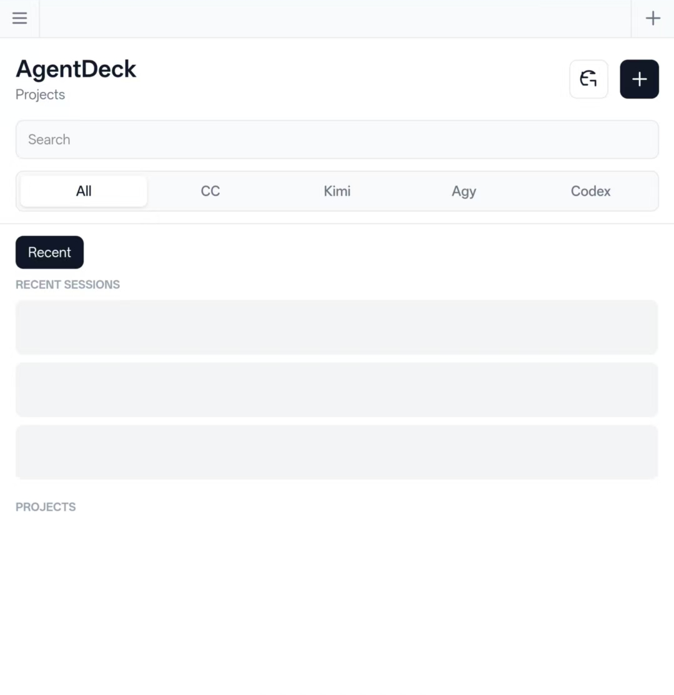

# AgentDeck

A web-based remote terminal for AI coding CLIs, one tab each. Reach them from any device — phone, tablet, or desktop — through a reverse tunnel ([frp](https://github.com/fatedier/frp)) from any network, or over [Tailscale](https://tailscale.com/) when you would rather not be on the public internet at all.

**Any agent CLI, not a fixed list.** The transport is a real PTY behind tmux, so
whatever runs in your terminal runs here — the deck never assumes which program
is on the other end. Everything in the plumbing (persistence across restarts,
tabs, file upload, touch scrolling, paste) is agent-agnostic and comes free with
any CLI you point it at.

What a *backend entry* adds on top is **understanding**: the chat view, the
history browser and one-click resume have to know where that CLI keeps its
transcript and how to read it. [Claude Code](https://docs.anthropic.com/en/docs/claude-code),
[Codex](https://github.com/openai/codex) and [Kimi Code](https://moonshotai.github.io/kimi-code/)
ship with that built in — those three are simply the ones I run daily and have
tested end to end. Teaching it a fourth is a day of adapter work, not a new
transport; see [Adding a CLI](#adding-a-cli).

**A real terminal, not a chat wrapper.** xterm.js + node-pty + tmux run the upstream CLI interactively, exactly as it behaves in your local terminal. Layered on top is an optional **chat view** — the same live session rendered as clean, scrollable message bubbles, so reading long replies and typing on a phone feel native, without giving up the real terminal underneath.

[中文 README](./README_CN.md)



*Three CLIs side by side — Kimi, Claude Code and Codex tabs across the top — with
past conversations in the sidebar. Session titles and project names in the
screenshot are placeholders.*

## Features

- **Mixed CLIs, one UI** — Spawn Claude Code, Codex or Kimi Code from the same browser and run them side by side; every session is tagged with its backend (blue for Claude, emerald for Codex, violet for Kimi). Any other CLI can take a tab too — it just won't have the chat and history layers until someone writes its adapter
- **History browser** — Cross-backend history view for up to the 25 most recently active sessions in the current backend / project filter. Search filters that loaded result set (there is no pagination yet); any listed session can be resumed in one click
- **Real terminal** — xterm.js renders the full terminal experience: colors, cursor, scrollback, links
- **Chat view** — Flip any live session into a structured chat: message bubbles, rendered Markdown, collapsible tool-call strips, auto-scroll that pauses when you scroll up. It reads the CLI's own transcript file, so it holds the complete, scrollable record — the terminal viewport can truncate a long reply, the chat view never does. One tap back to the real terminal for TUI prompts and pickers.
- **Send & interrupt from chat** — Type and send straight from the chat view (it writes to the PTY, same as typing in the terminal); a stop button interrupts the running agent. Attach an image or file inline — send a phone screenshot and the agent reads it.
- **Tab strip for live sessions** — Open sessions line the top of the screen as browser-style tabs, each with its backend badge and a dot that pulses while the agent works. A parallel Claude and Codex are one glance apart, on a phone as much as on a desktop.
- **Sidebar of past conversations** — The pane behind the tabs lists the 20 most recent conversations across every backend; tap one to resume it. A green dot means a live session is already writing that transcript, so tapping jumps into the running session instead of forking a second copy.
- **Live status** — A session shows what it is doing right now (the current tool call while working) or a preview of its last reply when idle.
- **New-session parameters** — Choose model, reasoning effort, and permission mode (Claude) or reasoning / sandbox (Codex) before spawning; every value is validated against the CLI's own flags.
- **Multi-session** — Click "+" to spawn up to 10 concurrent sessions, switch freely between them
- **tmux-backed persistence** — Sessions survive server restarts; the PTY lives in tmux, the WebSocket just attaches to it
- **Session ring buffer** — 5 MB of output per session is replayed on reconnect, so switching devices doesn't lose context
- **File upload** — Drag & drop onto the terminal, or click the paperclip in either view, to hand files to the running agent
- **Cross-device** — Works on iPhone, iPad, Android, and desktop browsers: over an frp reverse tunnel from any network, or inside a Tailscale tailnet
- **Built for thumbs** — Touch key bar (Esc, Tab, `^C`, arrows, paste) plus IME fixes for iOS 26. Drag anywhere on the terminal to scroll its history, with a flick that carries: xterm.js on iOS only scrolls when the drag starts on blank space ([#3613](https://github.com/xtermjs/xterm.js/issues/3613)), which a full screen never has, so the gesture is handled here instead. Long-press still opens the native selection menu, and a paste button covers the other direction — iOS gives no way to reach the hidden textarea a terminal pastes into
- **Copy without the fight** — One tap copies a code block, a whole reply, or any message in the history view. Code blocks wrap to the bubble instead of scrolling sideways, because dragging a horizontal scrollbar on a phone is nobody's idea of a good time
- **Dark/Light theme** — Follows system preference, toggleable in sidebar
- **Token auth** — The token is never embedded in the page HTML; supply it via a `?token=` link or the login prompt, and it's remembered per browser
- **Device allowlist** — A valid token is not enough: the browser must also be an approved device. An unrecognised one is blocked and you get a Telegram alert with a one-tap approval link, so a leaked token does not hand over a shell. Lost a phone? Revoke that one device and every other keeps working — see [Devices](#devices)
- **Single port** — HTTP + WebSocket on one port (default 3109), simple firewall setup

## Architecture

```
Browser (any device)          Server (your Mac)
┌──────────────────┐         ┌──────────────────────┐
│  xterm.js        │◄──WS──►│  server.ts            │
│  (Terminal UI)   │         │  ├─ Next.js (pages)   │
│  + backend tabs  │         │  ├─ WebSocket server  │
│                  │         │  └─ TerminalManager   │
│  IndexedDB       │         │     ├─ tmux:ccrt-#1   │──► claude (PTY)
│  (session list)  │         │     ├─ tmux:ccrt-#2   │──► codex  (PTY)
│                  │         │     ├─ tmux:ccrt-#3   │──► kimi   (PTY)
└──────────────────┘         │     └─ ...            │
                             │                       │
                             │  History scanner:     │
                             │  ~/.claude/projects/* │
                             │  ~/.codex/sessions/*  │
                             │  ~/.kimi-code/sessions│
                             └──────────────────────┘
```

- **server.ts** — Custom HTTP server serving Next.js pages + WebSocket upgrade on `/ws/terminal`
- **TerminalManager** — Manages tmux-backed PTY lifecycles, ring buffers, attach/detach per session
- **backends.ts** — Picks the right CLI (`claude`, `codex` or `kimi`) and builds the right argv, including each one's resume semantics (`--resume` / `resume` / `-S`)
- **history-index.ts** — Scans `~/.claude/projects/*/` (Claude Code), `~/.codex/sessions/*/` (Codex) and `~/.kimi-code/sessions/*/` (Kimi, via its `session_index.jsonl`) into one unified history browser
- **transcript-hub.ts / transcript-parser.ts / session-discovery.ts** — The read-side chat layer: finds the transcript file the CLI writes for a live session, tails it incrementally, parses it into structured messages + metadata (model, tokens, branch, tool calls), and streams them to the chat view. The CLI and terminal path stay untouched.
- **WebSocket protocol** — JSON messages: `create` / `attach` / `input` / `resize` / `kill` / `list` (terminal), plus `chat_attach` / `chat_event` / `chat_input` / `interrupt` / `watch_status` (chat + live status)

## Quick Start

### Prerequisites

- Node.js 20+ (or Bun)
- tmux (`brew install tmux` on macOS)
- At least one of:
  - [Claude Code CLI](https://docs.anthropic.com/en/docs/claude-code) — looked up at `~/.local/bin/claude`, `/opt/homebrew/bin/claude`, `/usr/local/bin/claude`
  - [Codex CLI](https://github.com/openai/codex) — looked up at `/opt/homebrew/bin/codex`, `/usr/local/bin/codex`, `~/.local/bin/codex`
  - [Kimi Code CLI](https://moonshotai.github.io/kimi-code/) — looked up at `~/.kimi-code/bin/kimi` first (its installer does not put itself on PATH), then `~/.local/bin/kimi` and the Homebrew prefixes

  You can install only one if you only need that backend; the UI will just fail to spawn the missing one.

- macOS (node-pty prebuilds are darwin-arm64; Linux should also work with rebuild)

### Install & Run

```bash
git clone https://github.com/AliceLJY/agentdeck.git
cd agentdeck
npm install

# Local development: create a private env file without printing the token
umask 077
printf 'AGENTDECK_TOKEN=%s\n' "$(openssl rand -hex 32)" > .env.local

# Build & start
npm run build
npm start
```

Open `http://localhost:3109` in your browser and paste the token into the login prompt. The token is saved in that browser. The sidebar's "+" button creates a new terminal; on the home screen, the All / CC / Codex / Kimi filter selects which backend new terminals start with.

### Remote Access

The server binds to `127.0.0.1` by default, so "remote access" is really the
question of how a browser reaches that port. Two answers, and they compose —
run both and use whichever the current network allows.

**Reverse tunnel (frp) — reachable from any network.** A phone on cellular, a
hotel Wi-Fi, a laptop behind someone else's NAT: anything that can reach a VPS
you control can reach the deck. Run [frp](https://github.com/fatedier/frp)'s
client next to AgentDeck and forward the port to your server:

```toml
# frpc.toml, on the machine running AgentDeck
serverAddr = "vps.example.com"
serverPort = 7000
auth.method = "token"
auth.token = "<your frp token>"

[[proxies]]
name = "agentdeck"
type = "tcp"
localIP = "127.0.0.1"   # frpc reaches the server locally — no need to widen AGENTDECK_HOST
localPort = 3109
remotePort = 3456
```

> **Terminate TLS on the server before using this for real.** A bare `tcp`
> proxy republishes plain HTTP on the public internet: the access token, every
> keystroke, and every uploaded file cross the network in the clear — and what
> sits behind that port is an interactive shell on your machine. Put nginx or
> Caddy in front of the forwarded port, or use frp's own `https2http` proxy with
> a certificate, so the browser talks HTTPS end to end.

**Tailscale — nothing published at all.** Devices on the same tailnet only,
which is the fallback when you don't want the deck exposed publicly. Bind to
the Tailscale address (preferred over `0.0.0.0`, which needs a host firewall in
front of it):

```bash
AGENTDECK_HOST=100.x.x.x npm start
```

The server auto-detects the address and prints it at startup:

```
[agentdeck] Tailscale: http://100.x.x.x:3109
```

Either way, paste the token into the login prompt rather than putting it in the
URL — URLs end up in browser history, proxy logs, and referrer headers.

### Auto-start (macOS launchd)

Generate a token in a private file outside the repository first. The command creates `~/.config/agentdeck/token` with mode `600` inside a mode-`700` directory and copies the token to the clipboard without printing it:

```bash
npm run token:init
```

Create a private log directory, then drop a plist like this into `~/Library/LaunchAgents/com.agentdeck.web.plist` and bootstrap it. The plist contains no token; the wrapper validates the private file's type, owner, mode, and format before reading it at process start.

```bash
install -d -m 700 ~/Library/Logs/agentdeck
```

```xml
<?xml version="1.0" encoding="UTF-8"?>
<!DOCTYPE plist PUBLIC "-//Apple//DTD PLIST 1.0//EN" "http://www.apple.com/DTDs/PropertyList-1.0.dtd">
<plist version="1.0">
<dict>
  <key>Label</key><string>com.agentdeck.web</string>
  <key>WorkingDirectory</key><string>/Users/YOU/Projects/agentdeck</string>
  <key>ProgramArguments</key>
  <array>
    <string>/Users/YOU/Projects/agentdeck/scripts/run-launchd.sh</string>
  </array>
  <key>EnvironmentVariables</key>
  <dict>
    <key>NODE_ENV</key><string>production</string>
    <key>PORT</key><string>3109</string>
    <key>AGENTDECK_HOST</key><string>100.x.x.x</string>
  </dict>
  <key>Umask</key><integer>63</integer>
  <key>RunAtLoad</key><true/>
  <key>KeepAlive</key><true/>
  <key>StandardOutPath</key><string>/Users/YOU/Library/Logs/agentdeck/out.log</string>
  <key>StandardErrorPath</key><string>/Users/YOU/Library/Logs/agentdeck/err.log</string>
</dict>
</plist>
```

```bash
launchctl bootstrap gui/$UID ~/Library/LaunchAgents/com.agentdeck.web.plist
```

Use `npm run token:copy` whenever another device needs the current token. Use `npm run token:init` again to rotate it, then restart the LaunchAgent; neither command prints the value.

## Configuration

| Environment Variable | Default | Description |
|---|---|---|
| `AGENTDECK_TOKEN` | (required) | Auth token; supplied directly for development or by the private-file launchd wrapper |
| `AGENTDECK_TOKEN_FILE` | `~/.config/agentdeck/token` | Private launchd token file; must be a user-owned regular file with mode `600` |
| `AGENTDECK_HOST` | `127.0.0.1` | Bind address. Leave it alone when fronting the app with frp — the tunnel connects locally. Widen it only for direct LAN/Tailscale access: a Tailscale IP, or `0.0.0.0` behind a host firewall |
| `PORT` | `3109` | Server port |
| `NODE_ENV` | `development` | Set to `production` for optimized builds |
| `AGENTDECK_TIME_ZONE` | `Asia/Singapore` | IANA time zone used in transcript timestamps |
| `AGENTDECK_TG_BOT_TOKEN` | (unset) | Telegram bot that delivers new-device alerts. Unset means alerts go to the server log only — the allowlist still blocks, you just have to look |
| `AGENTDECK_TG_CHAT_ID` | (unset) | Chat the alerts are sent to |
| `AGENTDECK_PUBLIC_URL` | (unset) | Public origin used to build the one-tap approval link, e.g. `https://term.example.com`. Without it the alert falls back to "approve on the Mac" |
| `AGENTDECK_STRICT_BOOTSTRAP` | (unset) | `1` disables trust-on-first-use entirely, including from loopback. Approve the first device by editing the store file by hand |
| `AGENTDECK_DEVICES_PATH` | `~/.agentdeck-devices.json` | Device allowlist location. Point a second instance elsewhere so it does not write into the live one |

The project was called `cc-remote-term` before it grew a second backend. The
old `CC_TERMINAL_*` variables are still read as a fallback, as is the old
`~/.config/cc-remote-term/token` path, so upgrading in place needs no edits.

## Devices

The token gets you to the door; the device allowlist decides whether it opens.
Every browser mints an opaque device id on first load and keeps it in
localStorage. The server admits a connection only when that id is already
approved — checked again on the WebSocket upgrade, not just in the UI.

**A new device.** It is blocked, and an alert goes to Telegram with a single-use
approval link. Tap it and the waiting browser lets itself in within a few
seconds; it is polling. Nothing can be approved from the blocked device itself.

**The first device.** With an empty allowlist, a connection *from loopback* is
adopted automatically, so `npm start` on the Mac never locks you out. A remote
caller is never adopted — an empty allowlist reached through the tunnel is a
request to approve, not a reason to trust.

**A stolen token.** The thief's browser has no approved id, so it lands blocked
and you get the alert. That is the alert worth acting on: rotate the token.

**A lost phone.** Revoke that device from the Devices panel or with:

```bash
curl -X POST -H "x-token: $AGENTDECK_TOKEN" -H 'Content-Type: application/json' \
  -d '{"action":"revoke","deviceId":"<id>"}' http://127.0.0.1:3109/api/devices
```

Every other device keeps its session. Rotating the shared token — which signs
everything out — is no longer the only lever.

**A damaged allowlist.** If the file exists but cannot be parsed, the server
refuses every device and leaves the file untouched for repair. It does not fall
back to "empty", because empty is what enables adoption.

### Limits

The id is an identifier, not a second secret: someone who copies both the token
*and* localStorage off an approved browser looks like that browser. What catches
that is the same device id connecting from two places at once — not implemented
yet, and the honest boundary of this feature.

Session limits (in `lib/types.ts`):

| Constant | Default | Description |
|---|---|---|
| `MAX_SESSIONS` | 10 | Maximum concurrent PTY sessions |
| `IDLE_TIMEOUT` | 30 min | Auto-kill detached idle sessions |
| `RING_BUFFER_SIZE` | 5 MB | Output history per session (replayed on attach / reconnect) |

## Adding a CLI

The three built-in backends are not a closed set — they are the ones that have
been tested end to end. The work of adding a fourth splits cleanly in two, and
the expensive half is optional.

**Free, no code.** Launching, the PTY, tmux persistence across restarts, tabs,
the ring buffer, file upload, touch scrolling, paste — none of it knows or cares
which CLI it is talking to. Any interactive program inherits all of it.

**The adapter.** The chat view, the history browser and one-click resume are a
different matter: they read the CLI's own transcript from disk, so they need to
know its shape. Adding Kimi as the third backend touched exactly these, and
nothing in the transport layer:

| File | What it learns |
|---|---|
| `lib/backends.ts` | argv rules — how to launch, how to resume, which flags are allowed through, badge colour |
| `lib/terminal-manager.ts` | where the executable lives (Kimi's installer skips `PATH`, so `PATH` alone reports "not installed") |
| `lib/history-index.ts` | where sessions are indexed on disk, and how to walk that index |
| `lib/transcript-parser.ts` | the transcript format — the heavy one. Claude and Codex log messages; Kimi logs an event stream that has to be folded back into messages |
| `lib/session-discovery.ts` | how to tell which transcript belongs to a session you just spawned |
| UI | an option in the new-session panel, a filter on the home screen, a colour |

Formats differ more than you would expect, which is why this is a day of work
rather than a config entry — but it stays a day of work, because the transport
never enters the picture.

## Tech Stack

- **Frontend**: Next.js 16 (App Router), React 19, Tailwind CSS 4, xterm.js 6
- **Backend**: Custom Node.js HTTP server, WebSocket (ws), node-pty, tmux (for session persistence)
- **Storage**: IndexedDB (client-side session list); session metadata persisted in `~/.agentdeck-sessions.json`

## Acknowledgements

Inspired by [Happy](https://github.com/slopus/happy).

## License

MIT
